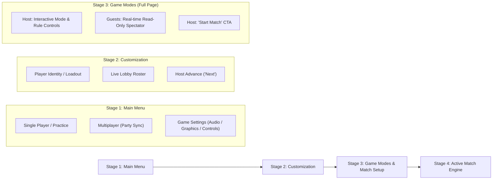

# PlayBuddies — Universal Game Menu & Lobby Architecture Requirements

## 1. Executive Summary & Design Vision

### 1.1 The Core Problem
Currently, game lobbies in PlayBuddies present an overwhelming "kitchen-sink" screen upon launch. Players are immediately confronted with:
- Simultaneous character selection, hull/skin picking, and inventory customization.
- Cluttered sub-menus for game rules, timers, weather, AI bots, and team management.
- Popups and modals competing for screen real estate (e.g., rules modals, weather selectors, settings dialogues).
- Confusion between offline/couch play and online multiplayer modes.
- Lack of clear visual hierarchy and pacing before entering a match.

### 1.2 The Design Vision: Progressive Stage-Based Flow
To create a high-polish, arcade-grade user experience, all games across PlayBuddies will transition to a **4-Stage Progressive Menu Pipeline**:



---

## 2. Universal Architecture & Screen Progression

### 2.1 Stage 1: Main Menu (Title Screen)
When any game loads, it immediately greets the player with a clean, branded title screen rather than dropping them into active roster grids or rule toggles.

#### Menu Options:
1. **Single Player (or Solo Practice)**:
   - Starts a local/offline session against AI bots or practice targets.
   - Bypasses network lobby synchronization while reusing Stages 2 and 3 locally.
2. **Multiplayer**:
   - For players entering via a shared room code / platform party.
   - **Host Behavior**: Interactive button. Clicking "Multiplayer" advances the entire room into Stage 2.
   - **Guest Behavior**: Disabled or displays a badge: `Waiting for host to select mode...`. Guests cannot split the room into solo play while attached to an active party.
3. **Game Settings (System / Preferences Only)**:
   - A standardized modal or side-drawer.
   - **STRICT BOUNDARY**: Includes *only* client-side system preferences:
     - **Audio**: Music volume slider (0-100%), Sound effects volume slider (0-100%), Mute all toggle.
     - **Graphics**: Low Power mode toggle (disables canvas particles, heavy ripple shaders, screen shake), 60 FPS cap, Canvas resolution scale.
     - **Controls**: Input scheme selector (Keyboard/Mouse vs Touch Joystick vs Gamepad), sensitivity slider, keybinding reference.
   - **EXCLUDED**: In-match rules, turn timers, win conditions, weather, or game modes are strictly forbidden from this modal.

---

### 2.2 Stage 2: Player Customization & Identity Selection
Once the host selects "Multiplayer" (or a solo player selects "Single Player"), the entire room transitions simultaneously to Stage 2.

#### Core Mechanics:
- **Individual Choice**: Each player configures their in-game visual representation and tactical loadout (e.g., Ship + Hull class in BOP, Fish species in Go Eat Fish, Ball skin in Mini Golf).
- **Network Sync**: Selections are written to each player's respective slot in `/lobbies/{roomId}` in real time.
- **Roster Display**: A compact roster bar shows connected captains/players, their current avatar preview, and their selection status.
- **Navigation Controls**:
  - **Host**: Features a prominent **`Next: Game Modes`** button.
  - **Guests**: Features a **`Ready`** indicator and status banner: `Waiting for host to configure match...`.

---

### 2.3 Stage 3: Game Modes & Match Configuration (Dedicated Full Page)
When the host clicks "Next", the room advances to a **dedicated full-page screen** for configuring the match. 

> [!IMPORTANT]
> **Game Modes must be a full-width, immersive page — NEVER a cramped popup or modal.**

#### Screen Layout (3 Functional Zones):
1. **Zone A: Game Mode Selector**:
   - Large, interactive cards representing available game modes (e.g., 1v1 Duel, 2v2 Team Battle, Free-for-All, Co-op Wave Survival, Time Attack).
   - Each card displays mode title, icon, supported player count, and brief summary.
2. **Zone B: Match Rules & Modifiers**:
   - Direct toggles and segmented controls for match parameters (Turn timers, Round counts, Map/Arena hazards, Power-up density, Weather conditions).
3. **Zone C: Fleet / Roster & Launch Action**:
   - Live roster showing team assignments (if team-based) or seat order.
   - Host has the primary **`Start Match`** / **`Launch Game`** button.

#### Host vs. Guest Permissions (The Read-Only Experience):
- **Host**:
  - All cards, toggles, and selectors are fully interactive.
  - Changes instantly synchronize to the room document.
- **Guests (Clients)**:
  - The exact same page is rendered for guests, but all controls are **read-only / visually locked** (featuring subtle lock icons or "Host Controlled" badges).
  - As the host clicks different modes or adjusts timers, the guest's screen updates in real time, giving them complete visibility into the match setup without allowing unauthorized edits.
  - A friendly header badge indicates: `Host is configuring the match...`.

---

### 2.4 Stage 4: Match View & Pause Flow
- Host clicks "Start Match", triggering `matchStarted: true` in the room state.
- All connected clients transition directly into the game engine screen.
- In-game settings button opens the system settings drawer (audio/graphics/controls only). No match-altering rules can be modified once a match has started.

---

## 3. Data Model & Room State Synchronization

### 3.1 Firestore Room Document Schema (`/lobbies/{roomId}`)
The room document state machine coordinates transitions across all connected clients:

```typescript
interface RoomLobbyDocument {
  roomId: string;
  hostId: string;
  hostSeenAt: FirebaseFirestore.Timestamp;
  status: 'waiting' | 'playing' | 'completed';
  
  // Progression Stage
  stage: 'menu' | 'customization' | 'game_modes' | 'playing';
  
  // Game Mode & Rules Configuration (Written solely by Host)
  gameMode: string;
  matchRules: number | Record<string, any>;
  customModifiers?: Record<string, any>;
  
  // Player Slots (Written by each player for their own slot)
  players: Record<string, {
    uid: string;
    displayName: string;
    photoURL?: string;
    isReady: boolean;
    joinedAt: number;
    fishIndex?: number | null; // Primary cosmetic (skin/character)
    role?: number | null;      // Secondary tactical choice (hull/class)
    team?: 0 | 1;              // Team assignment (for team modes)
  }>;
  
  matchStarted: boolean;
}
```

### 3.2 Transition State Rules
1. **Host Authority**: Only the user matching `hostId` can update `stage`, `gameMode`, `matchRules`, and `matchStarted`.
2. **Guest Authority**: Guests can only update their own sub-object under `players[uid]` (`fishIndex`, `role`, `isReady`).
3. **Host Migration**: If the host disconnects or leaves, the platform's existing `canClaimHost()` rule safely assigns a new host, who inherits the interactive controls on Stage 1, 2, or 3.

---

## 4. Game-by-Game Specific Requirements

Below is the concrete blueprint for each of the 8 games across PlayBuddies.

---

### 4.1 Battle of Pirates (BOP)

#### Current State:
RoomScreen combines ship skin grid, hull selector with stat dots, rules panel, weather selector, team management, and stats in a single overcrowded view.

#### New 4-Stage Architecture:
1. **Stage 1: Main Menu**:
   - **Visuals**: Dramatic open-sea background, animated waves, nautical banner "Battle of Pirates".
   - **Buttons**:
     - `Single Player` (Offline bot match with Swab/Gunner/Captain AI).
     - `Multiplayer` (Active for Host; disabled with "Waiting for host..." for guests).
     - `Game Settings` (Audio sliders for sea shanties & cannon SFX; Low Power toggle to disable canvas ripple shaders; Touch aiming sensitivity).
2. **Stage 2: Ship & Hull Selection**:
   - Clean tabbed interface:
     - **Tab 1: Ship Paint**: Cosmetic ship skin picker (Salt Dog, Reef Runner, etc.).
     - **Tab 2: Hull Class**: Tactical hull selection with auto-calculating balance stat dots (Balanced, Corsair, Juggernaut, Sniper, Raider).
   - Bottom bar shows connected captains in the fleet with their selected ship miniatures.
   - **Host Action**: `Next: Match Rules` button.
   - **Guest Action**: `Ready` checkmark toggle.
3. **Stage 3: Game Modes & Match Rules (Full Page)**:
   - **Mode Cards**:
     - *Duel (1v1)*: Single ship broadside duel.
     - *Fleet Skirmish (2v2)*: Tactical team coordination.
     - *Armada (3v3)*: Full fleet combat with cycling turns.
   - **Rule Toggles**:
     - *Weather Selection*: Calm Seas, Thunderstorm (dynamic lightning), Rain Squall, Night Mist, Random Sky.
     - *Mountain Hazards*: Solid Mountain (shots collide), Open Water, Shifting Reefs.
     - *Turn Timer*: Blitz (15s), Standard (30s), Unlimited.
     - *Special Abilities / Cards*: On / Off.
   - **Host View**: Interactive selectors + `Weigh Anchor` (Start) button.
   - **Guest View**: Read-only display of selected weather, mode, and rules + real-time status.

---

### 4.2 Go Eat Fish (Players Eat Fish)

#### Current State:
Starts straight on fish selection or lobby room with immediate fish picker and immediate start.

#### New 4-Stage Architecture:
1. **Stage 1: Main Menu**:
   - **Visuals**: Sunken reef backdrop, swimming ambient fish, vibrant tropical palette.
   - **Buttons**:
     - `Single Player` (Solo survival against predatory bot fish).
     - `Multiplayer` (Synchronized party play).
     - `Game Settings` (BGM volume, SFX volume, Low Power mode, Control Scheme: Virtual Joystick vs Pointer Follow vs WASD/Arrow keys).
2. **Stage 2: Fish Species Selection**:
   - Category-based aquarium grid:
     - *Reef Dwellers* (Clownfish, Blue Tang, Yellow Tang).
     - *Deep Abyss* (Anglerfish, Gulper, Lanternfish).
     - *Apex Predators* (Barracuda, Hammerhead, Great White).
     - *Mythic / Glow* (Phantom Leviathan, Golden Koi).
   - Displays unlocked fish vs coin shop unlocks.
   - **Host Action**: `Next: Coral Reef Rules` button.
   - **Guest Action**: Real-time fish preview + `Ready` toggle.
3. **Stage 3: Game Modes & Match Rules (Full Page)**:
   - **Mode Cards**:
     - *Free-For-All Frenzy*: Every fish for themselves; eat prey and rivals to become the largest predator.
     - *Co-op Reef Defense*: Players work together to eat schools of invading jellyfish before time expires.
     - *Survival Race*: First player to reach Max Size (Stage 5 Leviathan) wins.
   - **Rule Toggles**:
     - *Friendly Fish (No PvP)*: Enabled (players cannot eat each other, only AI fish) / Disabled (full cannibalism enabled).
     - *Predator Shark Hazards*: Normal, Swarm, None.
     - *Match Duration*: 3 Minutes, 5 Minutes, Infinite (until one fish remains).
   - **Host View**: Full interactive selection + `Dive In` CTA.
   - **Guest View**: Read-only real-time card highlights showing selected mode and hazard rules.

---

### 4.3 Mini Golf

#### Current State:
Displays ball picker, club tier selector, hole counts, and shouts all in one room screen.

#### New 4-Stage Architecture:
1. **Stage 1: Main Menu**:
   - **Visuals**: Stylized 3D-angled green, fairway banner, golf course ambiance.
   - **Buttons**:
     - `Single Player` (Practice on any hole or solo course run).
     - `Multiplayer` (Party tournament).
     - `Game Settings` (SFX volume, Announcer Shouts on/off, Aim trajectory line guide on/off, Low Power mode).
2. **Stage 2: Ball Customization**:
   - Ball material and cosmetic skin picker (Classic White, Fireball, Neon Glow, Marble, Gold Ingot, 8-Ball).
   - Trail effect selector (None, Stardust, Flame, Bubbles).
   - Live roster showing each player's customized golf ball resting on the tee.
   - **Host Action**: `Next: Course Selection` button.
   - **Guest Action**: `Ready` checkmark.
3. **Stage 3: Course & Tournament Setup (Full Page)**:
   - **Mode Cards**:
     - *Stroke Play*: Classic golf — lowest total strokes across all holes wins.
     - *Speed Golf*: Simultaneous putting race — least time + strokes wins.
     - *Skins Game*: Winner of each individual hole earns a coin bounty.
   - **Course & Rule Toggles**:
     - *Course Length*: 3 Holes (Sprint), 9 Holes (Standard), 18 Holes (Championship).
     - *Course Environment*: Meadow Hills, Coastal Dunes, Volcanic Crater, Neon Night.
     - *Wind & Physics Hazard*: Calm, Gusty Winds, Super Bouncy Turf.
     - *Stroke Limit Per Hole*: 6 Strokes, 10 Strokes, Unlimited.
   - **Host View**: Interactive course selector + `Tee Off` (Start Match) button.
   - **Guest View**: Read-only course overview showing preview card of chosen holes.

---

### 4.4 Quoridor

#### Current State:
Combines pawn picker, 2-player vs 4-player rules, wall counts, board preview, and bot toggles into a single view.

#### New 4-Stage Architecture:
1. **Stage 1: Main Menu**:
   - **Visuals**: Minimalist wood & stone board aesthetic, ambient strategy theme.
   - **Buttons**:
     - `Single Player` (Pass-and-play or AI practice match).
     - `Multiplayer` (Synchronized board match).
     - `Game Settings` (Move sound volume, Valid Step Hint highlights on/off, Wall placement snap assist toggle).
2. **Stage 2: Pawn & Wall Token Customization**:
   - Pawn cosmetic shape/finish (Polished Mahogany, Obsidian Stone, Ivory, Brass Knight, Jade Pawn).
   - Custom wall finish (Oak Timber, Marble Slab, Iron Grate).
   - **Host Action**: `Next: Board Setup` button.
   - **Guest Action**: `Ready` toggle.
3. **Stage 3: Board Setup & Game Rules (Full Page)**:
   - **Mode Cards**:
     - *Classic Duel (1v1)*: Direct 2-player opposite wall race.
     - *4-Player Cross (Free-for-All)*: 4 corners racing to opposite perimeters.
     - *2v2 Team Relay*: Teammates share wall pool and coordinate pathways.
   - **Rule Toggles**:
     - *Board Size*: Classic 9x9, Mini 7x7 (Fast Blitz).
     - *Wall Inventory*: Standard (10 walls for 2P / 5 walls for 4P), Abundant (15 walls), Scarcity (5 walls).
     - *Turn Timer*: 15 seconds (Blitz), 30 seconds (Standard), 60 seconds (Tactical).
   - **Host View**: Full interactive selection + `Place Pawns` (Start) button.
   - **Guest View**: Read-only display of board layout, wall allowances, and timers.

---

### 4.5 The Last Gasp

#### Current State:
Presents letter gallows, avatar tokens, round counts, and word categories in an immediate landing view.

#### New 4-Stage Architecture:
1. **Stage 1: Main Menu**:
   - **Visuals**: Moody pirate dock, swinging lantern, silhouette gallows.
   - **Buttons**:
     - `Single Player` (Solo word puzzle decipher).
     - `Multiplayer` (Party hanging showdown).
     - `Game Settings` (SFX volume, Mark Used Letters on keyboard toggle, High contrast keyboard mode).
2. **Stage 2: Outlaw Face Token Customization**:
   - Face avatar selector (Old Salt, Bilge Rat, Sea Witch, Captain Blackbeard, Ghost Sailor).
   - Gallows color banner / custom prisoner placard.
   - Live lineup of all prisoners waiting on the gallows scaffold.
   - **Host Action**: `Next: Word Categories` button.
   - **Guest Action**: `Ready` indicator.
3. **Stage 3: Word Duel Rules & Categories (Full Page)**:
   - **Mode Cards**:
     - *Gallows Royale (FFA)*: Everyone guesses simultaneously; incorrect letters add pieces to your own gallows.
     - *Head-to-Head Duel*: Players alternate turns guessing a secret word.
     - *Co-op Escape*: All players pool guesses against an elusive hidden phrase.
   - **Rule Toggles**:
     - *Word Category*: Pirate Lore, General English, World Geography, Movies & TV, Science & Tech, Random Blend.
     - *Difficulty / Word Length*: Easy (4-6 letters), Medium (7-9 letters), Hard (10+ letters).
     - *Rounds to Win*: Best of 3, Best of 5, Sudden Death (1 Mistake Hangs).
   - **Host View**: Interactive category cards + `Hangman's Draw` (Start) button.
   - **Guest View**: Read-only preview of selected category, round length, and difficulty level.

---

### 4.6 Tower Siege

#### Current State:
Lobby immediately displays single-player vs co-op buttons, castle graphics, AI difficulty, and settings mixed into one panel.

#### New 4-Stage Architecture:
1. **Stage 1: Main Menu**:
   - **Visuals**: Vibrant cartoon fortress wall, siege engines in background, heroic fantasy audio.
   - **Buttons**:
     - `Single Player` (Solo castle defense against invasion waves).
     - `Multiplayer` (Co-op or PvP Siege).
     - `Game Settings` (BGM volume, SFX volume, Control scheme: Drag-and-drop vs Click-to-place, Low Power mode).
2. **Stage 2: Hero Defender & Castle Crest Selection**:
   - Defender Class / Archetype picker:
     - *Royal Archer* (High range, rapid single-target pierce).
     - *Arcane Pyromancer* (Area-of-effect fire splash).
     - *Siege Engineer* (Ballista & wall fortification buffs).
     - *Paladin Commander* (Aura buffs and barricade repair).
   - Castle cosmetic banner (Lion Rampant, Dragon Flame, Kraken Tentacle).
   - **Host Action**: `Next: War Room` button.
   - **Guest Action**: `Ready` status toggle.
3. **Stage 3: Siege Modes & Battlefield Rules (Full Page)**:
   - **Mode Cards**:
     - *Co-op Fortress Defense*: 2 or 4 players defend one shared mega-castle against 20 escalating waves; each player earns their own gold from defense towers.
     - *1v1 Siege Versus*: Two castles on opposite ends of a shared lane; players balance building defense towers while spawning assault minions against each other.
     - *Endless Nightmare*: Endless wave survival with online leaderboard ranking.
   - **Rule Toggles**:
     - *Starting Gold Treasury*: Low (100g), Standard (250g), Opulent (500g).
     - *Wave Pacing*: Normal, Blitz (waves arrive 25% faster), Boss Rush.
     - *Map Environment*: King's Highroad, Cursed Bog, Mountain Pass.
   - **Host View**: Full interactive selection + `Sound the Horn` (Start) button.
   - **Guest View**: Read-only display of map, starting resources, and wave mode.

---

### 4.7 Volley Clash

#### Current State:
Combines athlete character picker, team selections, win conditions, and court settings in a single screen.

#### New 4-Stage Architecture:
1. **Stage 1: Main Menu**:
   - **Visuals**: Sunny beach volleyball court or energetic indoor arena, upbeat arcade music.
   - **Buttons**:
     - `Single Player` (Solo exhibition match against AI bot).
     - `Multiplayer` (Party volleyball tournament).
     - `Game Settings` (BGM volume, SFX volume, Controls: Arrow Keys vs WASD vs Touch Joypad, Jump Assist indicator toggle, Low Power mode).
2. **Stage 2: Athlete Selection**:
   - Character picker with clear attribute radar/stat bars:
     - *Spike Specialist* (Maximum smash velocity, lower dive recovery).
     - *Speedy Defender* (High horizontal agility, agile digs).
     - *All-Rounder* (Balanced jump, power, and dive).
     - *Trickster* (Spin serves and curved floaters).
   - Uniform / Jersey color picker.
   - **Host Action**: `Next: Match Rules` button.
   - **Guest Action**: `Ready` checkmark.
3. **Stage 3: Tournament Rules & Court Selection (Full Page)**:
   - **Mode Cards**:
     - *1v1 Singles*: Pure one-on-one volleyball agility.
     - *2v2 Doubles*: Team coordination, setting, and blocking.
   - **Rule Toggles**:
     - *Score Target*: First to 5, First to 7, First to 11, First to 15 Points.
     - *Win By Two Rule*: Enabled / Disabled.
     - *Arcade Power-Ups*: Super Jump, Flaming Spike, Ice Block Net, Multi-Ball (Enabled: Normal / High Frequency / None).
     - *Court Environment*: Sunny Palms Beach, Midnight Neon Stadium, Rooftop Sunset.
   - **Host View**: Interactive selectors + `Serve Ball` (Start) button.
   - **Guest View**: Read-only display of score target, power-up rules, and selected venue.

---

### 4.8 Wanted Board

#### Current State:
Roster, outlaw cards, board target bounties, turn timers, and rules are presented at once upon room entry.

#### New 4-Stage Architecture:
1. **Stage 1: Main Menu**:
   - **Visuals**: Vintage Wild West saloon table, wood grain, wanted posters pinned to corkboard, dusty western audio.
   - **Buttons**:
     - `Single Player` (Solo outlaw practice board against AI Marshal).
     - `Multiplayer` (Wild West bounty chase with room members).
     - `Game Settings` (SFX volume, Path highlighting assist on/off, Dice roll animation speed: Fast / Normal).
2. **Stage 2: Outlaw Character Selection**:
   - Outlaw token selection (Billy the Quick, Calamity Jane, Doc Holiday, Iron Mask, El Bandido).
   - Posse badge and player pin color.
   - Live roster display of all outlaws ready around the map table.
   - **Host Action**: `Next: Bounty Rules` button.
   - **Guest Action**: `Ready` toggle.
3. **Stage 3: Bounty Target & Board Setup (Full Page)**:
   - **Mode Cards**:
     - *Bounty Race (Classic)*: First outlaw to amass the target bounty purse ($5,000 / $10,000) and escape wins.
     - *Sheriff's Hunt*: One player or AI acts as the Sheriff; remaining outlaws must survive 15 turns while robbing bank coaches.
     - *Territory Monopoly*: Claim deeds to saloons, mines, and railroads across the frontier.
   - **Rule Toggles**:
     - *Target Bounty Purse*: $5,000 (Quick Match), $10,000 (Standard), $20,000 (High Stakes).
     - *Dynamic Roadblocks & Hazards*: Frequent, Rare, None.
     - *Turn Timer*: 20s (Fast Draw), 40s (Standard), Unlimited.
   - **Host View**: Interactive sliders & mode cards + `Deal the Cards` (Start) button.
   - **Guest View**: Read-only display of bounty goals, turn limits, and board modifiers.

---

## 5. Technical Implementation & Shared Component Architecture

To minimize boilerplate and prevent code duplication across the 8 games, the implementation will introduce shared UI and state primitives under `games/_shared/ui/`:

### 5.1 Shared Primitives
1. **`<StageRouter>`**:
   Manages client view transitions based on `lobby.stage` (or local stage in offline play).
2. **`<MainMenuShell>`**:
   Standardized title header, single player / multiplayer buttons, and settings modal trigger with themeable game-specific background art.
3. **`<ReadOnlyHostGuard>`**:
   Wraps interactive elements on Stage 3. When `isHost === false`, automatically disables inputs and applies sleek read-only styling with a "Configured by Host" tooltip.
4. **`<GameSettingsModal>`**:
   Strictly isolated settings dialog providing audio sliders, graphics/low-power toggles, and control scheme options.
5. **`<ModeSelectionCard>`**:
   Polished, responsive card component with icon, badge, description, and active selection border.

---

## 6. Verification & Acceptance Criteria

| Stage / Feature | Acceptance Criteria |
|---|---|
| **Stage 1: Main Menu** | Launching any game displays a title screen with Single Player, Multiplayer, and Settings. Non-host guests have Single/Multiplayer locked with "Waiting for host" badge. |
| **Settings Boundary** | Settings modal contains ONLY Audio, Graphics, and Controls. Zero game modes, rules, or match timers present in the settings dialog. |
| **Stage 2: Customization** | When host clicks Multiplayer, all connected clients transition simultaneously to character/skin customization. Players pick independently. |
| **Stage 3: Dedicated Page** | Host clicking "Next" transitions all players to a full-screen Game Modes page (NOT a popup). |
| **Real-Time Read-Only** | On Stage 3, host has interactive toggles; guests see read-only synced values that update in real time as the host makes adjustments. |
| **Launch Execution** | Host clicking Start Match launches all connected players directly into the active game engine without any leftover lobby elements. |
